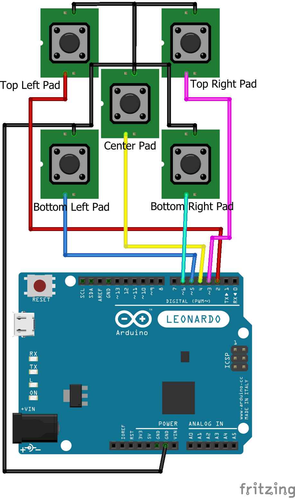

# Dance Pad Controller

This is an Arduino based controller for home brew and DIY dance pads,
like DDR or PIU pads.

## Features:

* Emulates a USB Game controller, by becoming a HID device (requires an Arduino
that supports HID natively)
* Supports PIU, DDR, and any other type of panel-based dance pad, as it can
control any number of pads, from 1 to as many input pins the Arduino board has
* Supports **LED strips** to light up the pads when a player steps on them
(requires the [FastLED library](https://github.com/FastLED/FastLED))
* Implements debouncing to mitigate double-stepping issues

## Setup

### Sensors

Each individual pad on the dance pad (*aka* dance **mat**) should have one or
more step sensors. These sensors are usually two conductive plates separated by
an air gap. When the player steps on the pad, the gap closes and an electrical
connection is made. This is essentially a simple momentary switch.

Multiple sensors on the same pad must be wired in parallel, as this controller
does not support detecting individual sensors on a single pad. Here's a rough
wiring schematic showing the connection of a Pump it Up pad to the Arduino
board:

  

### LEDs

TODO

## Configuration

The file `configuration.h` contains all possible customizations for the
controller (unless you fork this project and roll your own :) ). These are the
existing options:

### Pads (sensors) configuration

* **DEBOUNCE_INTERVAL**: Debounce interval in milliseconds. This is to prevent
bouncing, which happens when the electrical contact is briefly lost on the pad
due to physical bouncing. If absent, a single pad step would usually result in
extra step inputs being sent to the controller, causing gameplay issues.
*Defaults to `20`*
* **NUMBER_OF_PADS**: Number of pads present in the dance mat.
This would be 4 for DDR, and 5 for PIU. *Defaults to `5`*
* **SENSOR_PINS**: Arduino pins where each pad is connected to. Sensors will be
treated as momentary switches, and will be set in Arduino as `INPUT_PULLUP`.
The file `mappings.h` defines mappings for PIU and DDR.
*Defaults to `PIU_SENSOR_PINS`*

### LEDs configuration

* **PADS_HAVE_LEDS**: Flag that sets whether the dance mat has LEDs that light
up when the player steps on them. Comment to disable. *Defaults to `enabled`*

* **LED_CHIPSET**: The LED chipset.
Refer to https://github.com/FastLED/FastLED#supported-led-chipsets
for a list of supported chipsets. *Defaults to `WS2812B`*

* **LED_RGB_ORDER**: The RGB order of the LED chipset.
*Defaults to `RGB`*

* **LED_PIN**: Arduino Pin where the Data pin of the LED is connected to.
This pin should be connected to the Din input on the first LED of the first pad.
From there, the D0 (output) wire should connect to the Din wire on the first LED
of the second pad, and so on. *Defaults to `8`*

* **LEDS_PER_PAD**: How many LEDs are there per pad. The total current draw of
the mat should be taken into account when choosing the numbe of LEDs.
*Defaults to `8`*

* **INIT_INSPECT_DELAY**: Duration in milliseconds for which the LEDs flash on
when the pad is initialized. This can be used to make sure the LEDs are working,
and also as an indicator that the pad is now online and ready for use.
*Defaults to `1000`*

* **PAD_COLORS**: Map LED colours to pads. The file `mappings.h` defines
mappings for PIU and DDR. *Defaults to `PIU_PAD_COLORS`*

## License

[MIT](./LICENSE)